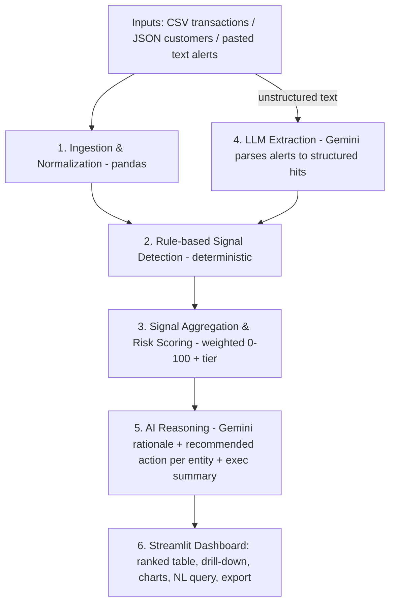

# Financial Risk Signal Aggregator — End-to-End Build Plan

> **Assignment:** FirstSource take-home (3 days). Build an AI prototype that ingests structured + unstructured financial data from multiple sources and produces a **prioritised, risk-scored summary with AI-generated rationale** for a compliance/risk audience.
>
> **Deliverables:** (1) Working demo (data in → AI analysis → risk summary out), (2) 5-slide deck (fixed structure), (3) README + sample data + output screenshots.
>
> **This document is the execution plan** — detailed enough to hand to Codex file-by-file, or to build together phase-by-phase.

---

## 0. The Big Idea (read this first — it's what wins marks)

The rubric weights **AI reasoning quality + accuracy of risk signals at 40%** and **prioritisation logic + clarity at 30%**. The winning design decision is a **hybrid: deterministic rules produce the risk score; the LLM does synthesis + language.**

- **Rules engine (Python/Pandas)** detects anomalies and computes an **auditable, reproducible risk score (0–100)**. Compliance can't accept a black box that hallucinates a score.
- **Gemini (LLM)** does what it's genuinely best at: (a) **parsing unstructured text** (adverse media / alerts / analyst notes) into structured signals, and (b) **generating a human-readable rationale + recommended action** that cites the specific evidence. The LLM **explains** the score; it never **invents** it.

This "explainable score + AI narrative" split is the single most impressive architectural choice you can make here, and you should call it out explicitly in the deck and README.

**Second key idea — multi-source correlation.** The value isn't flagging one bad transaction; it's **aggregating fragmented weak signals per customer/entity** (a transaction pattern + a KYC flag + an adverse-media hit) into one strong, prioritised view. That directly answers the brief's "synthesize fragmented signals into a coherent, prioritised risk view."

---

## 1. Locked Tech Stack

| Layer | Choice | Version / Model | Why | Notes |
|---|---|---|---|---|
| Language | Python | 3.11+ | Standard for the Pro-Code track | |
| Data wrangling | **pandas** | 2.x | Ingest/normalise/join CSV + JSON | |
| LLM | **Google Gemini** via `google-generativeai` | `gemini-2.0-flash` (fallback `gemini-1.5-flash`) | **Free API tier**, strong reasoning, fast | Key from https://aistudio.google.com/apikey (no billing to start) |
| UI / app | **Streamlit** | 1.3x | Fastest path to an interactive dashboard demo | |
| Charts | **Plotly** | 5.x | Risk distribution + tier breakdown | Rendered via `st.plotly_chart` |
| Config / secrets | **python-dotenv** + `st.secrets` | — | `.env` locally, secrets on cloud | Never commit the key |
| Data models | **pydantic** (or dataclasses) | 2.x | Validate LLM JSON output | Optional but shows rigor |
| Testing | **pytest** | — | Unit-test the scoring rules | Optional, strong signal of quality |
| Deploy | **Streamlit Community Cloud** | — | Free hosted URL | https://share.streamlit.io |
| Repo | **GitHub** | — | Required by cloud deploy + submission asset | Public or free-private |

### `requirements.txt`
```
streamlit>=1.31
pandas>=2.0
google-generativeai>=0.8
python-dotenv>=1.0
plotly>=5.18
pydantic>=2.0
pytest>=8.0
```

### Gemini free-tier notes
- Get key: **aistudio.google.com/apikey** → "Create API key" (free, works without billing).
- `gemini-2.0-flash` free limits are generous for a demo (roughly ~15 requests/min, ~1500/day — check current limits). The app makes only a handful of calls per analysis run, so you're well within limits.
- **Cost control in code:** batch entities, cache results in `st.session_state`, and only call the LLM for flagged entities (not the whole dataset).

---

## 2. Architecture & Data Flow



ASCII fallback:
```
Inputs (CSV / JSON / pasted text)
   -> [1] Ingestion & Normalization (pandas): parse, standardize, join on customer_id/account_id
   -> [4] LLM Extraction (Gemini): unstructured alerts/adverse media -> structured hits per entity
   -> [2] Rule Engine (deterministic): fire anomaly signals with weight + evidence
   -> [3] Scoring: aggregate signals per entity -> score 0-100 -> tier -> priority rank
   -> [5] AI Reasoning (Gemini): per-entity rationale + recommended action; portfolio exec summary
   -> [6] Streamlit: ranked table + drill-down + charts + optional NL query + CSV/JSON export
```

**Design principle:** Layers 1–3 run with **zero LLM calls** and produce a complete, auditable result. Layers 4–5 enrich it. If the API key is missing, the app still works (rules-only mode) — build this as a graceful fallback; it's a great "robustness" talking point.

---

## 3. Data Model (3 sources → demonstrate multi-source correlation)

### Source 1 — Transactions (`data/transactions.csv`, structured)
Columns: `txn_id, timestamp, customer_id, account_id, amount, currency, txn_type` (deposit/withdrawal/wire/cash), `counterparty, counterparty_country, channel` (branch/online/mobile).

### Source 2 — Customers/Accounts (`data/customers.json`, structured)
Fields per customer: `customer_id, name, kyc_status` (verified/pending/incomplete), `base_risk_rating` (low/med/high), `account_open_date, country, is_pep` (bool), `expected_monthly_volume, occupation`.

### Source 3 — External Alerts / Adverse Media (`data/external_alerts.txt`, UNSTRUCTURED)
Free-text analyst notes / news snippets / watchlist entries, e.g.:
> "Reuters (12 Jun): ACME Trading, linked to customer Ravi Menon, named in an ongoing bribery probe. — Internal note: John Doe's wire counterparty appears on OFAC advisory list. — Watchlist: no hits for Priya Shah."

This is the text Gemini parses into structured hits tied to entities.

### Planted scenarios (design the sample data so the demo tells a story)
| Customer | Planted scenario | Expected outcome |
|---|---|---|
| **A — Ravi Menon** | 8 cash deposits of $9,500 in 3 days (structuring, just under $10k CTR) + adverse-media hit | **Critical** |
| **B — John Doe** | PEP + large wire to sanctioned/high-risk jurisdiction + OFAC counterparty note | **Critical/High** |
| **C — Wei Chen** | Dormant 18 months, then $250k in and $248k out same day (pass-through/layering) | **High** |
| **D — Priya Shah** | Normal salary + bills, KYC verified, no hits | **Low** (control — proves it doesn't over-flag) |
| **E — Sara Lopez** | New account, volume 10x expected in week 1 (velocity spike) | **Medium/High** |

The control case (D) matters: it demonstrates precision, not just flagging everything.

---

## 4. Rule Engine — Signal Detection (`src/rules.py`)

Each rule returns a **signal** object: `{code, label, weight, evidence, entity_id}`. Thresholds/weights live in `config.py` so they're tunable and auditable.

| Rule code | Detects | Logic (starting point) | Weight |
|---|---|---|---|
| `STRUCTURING` | Smurfing under reporting threshold | ≥3 cash txns in [9000, 9999] within 7 days | 30 |
| `HIGH_VALUE_WIRE` | Large transfers | single wire ≥ $50k | 15 |
| `HIGH_RISK_JURISDICTION` | Sanctioned/FATF-grey counterparty country | counterparty_country in watchlist set | 25 |
| `VELOCITY_SPIKE` | Sudden activity surge | monthly volume ≥ 5× expected_monthly_volume | 20 |
| `DORMANT_REACTIVATION` | Dormant then active | no txns 180+ days, then txn ≥ $50k | 20 |
| `PASS_THROUGH` | Rapid in-out / layering | inflow and ~equal outflow (≥90%) within 48h | 25 |
| `ROUND_NUMBER` | Round-figure wires | wire amount divisible by 10,000 | 5 |
| `KYC_INCOMPLETE` | Onboarding gap | kyc_status != verified | 10 |
| `PEP_EXPOSURE` | Politically exposed person | is_pep == true | 15 |
| `CASH_INTENSIVE` | Cash-heavy profile | cash txns > 60% of volume | 10 |
| `ADVERSE_MEDIA` | External negative signal | LLM-extracted hit with severity ≥ medium | 20 |

Keep each rule a small pure function `def rule_structuring(txns_df, customer) -> list[Signal]` so they're independently testable.

---

## 5. Scoring & Prioritisation (`src/scoring.py`)

1. Collect all signals per `customer_id`.
2. `raw = sum(signal.weight)`; `score = min(100, raw)`.
3. Tier: `0–24 Low · 25–49 Medium · 50–74 High · 75–100 Critical`.
4. **Priority rank** = sort by `score` desc, tie-break by count of **distinct** signal types (more independent signals = stronger case), then by max single-signal weight.
5. Emit a ranked table: `rank, customer_id, name, score, tier, num_signals, top_signals`.

Thresholds/weights are deliberately transparent and documented — a compliance analyst can trace exactly why a score is what it is.

---

## 6. LLM Layer (`src/llm.py`) — Gemini

Four functions, each with a prompt in `/prompts`. All prompts instruct the model to **use only supplied evidence** and **return strict JSON** (validate with pydantic; retry once on parse failure).

1. **`extract_alerts(text, known_entities) -> list[hit]`**
   Parse unstructured alert text → `[{entity_id, alert_type, severity(low/med/high), summary, source}]`. Feed hits into the `ADVERSE_MEDIA` rule.

2. **`entity_rationale(entity_profile, fired_signals, score, tier) -> {rationale, recommended_action, confidence}`**
   3–4 sentence compliance-grade rationale citing the specific signals + evidence; recommended action from a fixed set (`Monitor` / `Enhanced Due Diligence` / `Escalate to MLRO` / `File SAR`). Guardrail: *"Base your explanation only on the provided signals and evidence. Do not invent facts or a score."*

3. **`exec_summary(ranked_entities) -> str`**
   Portfolio-level paragraph for a compliance lead: how many critical/high, dominant patterns, what to action first.

4. **`nl_query(question, risk_data_context) -> str`** *(optional enhancement)*
   Answer analyst questions grounded in the structured risk data ("Which customers have sanctions exposure?", "Why is Ravi Menon critical?").

**Robustness:** wrap all calls in try/except; if the key is missing or a call fails, fall back to a templated rationale built from the fired signals so the app never breaks.

---

## 7. Streamlit App (`app.py`)

Layout:
- **Sidebar:** file uploaders (transactions CSV, customers JSON), a textarea for pasted alerts, "Load sample data" button, "Run analysis" button, API-key status indicator.
- **Main — tabs:**
  1. **Overview:** exec summary + KPI tiles (total entities, #Critical/#High) + Plotly charts (tier distribution bar, score histogram).
  2. **Prioritised Risk Register:** `st.dataframe` sorted by rank, color-coded tier, clickable/selectable row.
  3. **Entity Drill-down:** selected customer's profile, fired signals with evidence, score gauge, AI rationale, recommended action, confidence.
  4. **Ask (NL query):** optional chat box over the risk data.
  5. **Export:** download ranked results as CSV/JSON.
- Cache the analysis in `st.session_state` so re-renders don't re-hit the API.

---

## 8. Repo Structure

```
financial-risk-aggregator/
├── app.py                    # Streamlit UI
├── config.py                 # rule weights, thresholds, tier cutoffs, watchlist countries
├── requirements.txt
├── .env.example              # GEMINI_API_KEY=your_key_here
├── .gitignore                # .env, __pycache__, .venv
├── README.md
├── src/
│   ├── __init__.py
│   ├── ingestion.py          # load+normalize CSV/JSON/text, join on customer_id
│   ├── rules.py              # deterministic signal rules
│   ├── scoring.py            # aggregate -> score -> tier -> rank
│   ├── llm.py                # Gemini: extract, rationale, summary, nl_query
│   └── schemas.py            # pydantic models: Signal, Hit, EntityRisk
├── prompts/
│   ├── extract_alerts.txt
│   ├── entity_rationale.txt
│   ├── exec_summary.txt
│   └── nl_query.txt
├── data/
│   ├── transactions.csv
│   ├── customers.json
│   └── external_alerts.txt
├── tests/
│   └── test_scoring.py       # assert planted scenarios produce expected tiers
└── docs/
    └── screenshots/
```

---

## 9. Three-Day Timeline

### Day 1 — Deterministic core (no LLM yet)
- [ ] Create repo + venv + `requirements.txt`; `git init`, first commit.
- [ ] Hand-craft `data/` sample files with the 5 planted scenarios (§3).
- [ ] `config.py` (weights/thresholds/watchlist), `src/schemas.py`.
- [ ] `src/ingestion.py` — load & join sources into a clean per-entity structure.
- [ ] `src/rules.py` — implement all rules.
- [ ] `src/scoring.py` — aggregate, score, tier, rank.
- [ ] Quick CLI/`if __name__=="__main__"` sanity check: prints ranked table; planted scenarios land in expected tiers.
- **Exit criteria:** ranked risk register prints correctly from sample data, LLM-free.

### Day 2 — Gemini + Streamlit
- [ ] `src/llm.py` + `/prompts` — implement extraction, rationale, exec summary. Test each in isolation with a printout.
- [ ] Wire `ADVERSE_MEDIA` rule to LLM extraction output.
- [ ] `app.py` — sidebar inputs, "Load sample data", Overview + Register + Drill-down tabs, Plotly charts.
- [ ] Graceful no-key fallback (templated rationale).
- **Exit criteria:** `streamlit run app.py` → upload/sample → full dashboard with AI rationale works locally.

### Day 3 — Polish, deploy, package
- [ ] Optional: NL query tab; `tests/test_scoring.py`.
- [ ] UI polish (color-coded tiers, KPI tiles, export).
- [ ] Push to GitHub → deploy to Streamlit Community Cloud → add `GEMINI_API_KEY` secret → get live URL.
- [ ] Write `README.md` (§11), capture screenshots to `docs/screenshots/`.
- [ ] Record <3-min screen demo (§12 script).
- [ ] Build 5-slide deck (§13).
- [ ] Buffer for fixes.

---

## 10. Codex-ready build prompts (paste one per file, in order)

> Give Codex this PLAN.md as context first, then these prompts sequentially. Each is scoped to one file so output stays reviewable.

1. **config.py** — "Create `config.py` holding rule weights, numeric thresholds, tier cutoffs (Low/Med/High/Critical), and a set of high-risk/sanctioned counterparty countries, per §4–§5 of PLAN.md. Values as named constants."
2. **schemas.py** — "Create pydantic models `Signal`, `AlertHit`, `EntityRisk` matching the fields in §4 and §6 of PLAN.md."
3. **ingestion.py** — "Write `load_transactions(path/df)`, `load_customers(path/dict)`, `load_alerts(text)`, and `build_entities()` that joins transactions to customers on customer_id and returns a dict of per-entity data. Handle CSV, JSON, and pasted text per §3."
4. **rules.py** — "Implement each rule in §4 as a pure function returning `list[Signal]`, plus `run_all_rules(entity, adverse_hits)`. Use thresholds from config.py."
5. **scoring.py** — "Implement `score_entity(signals)` and `rank_entities(entities)` per §5: sum weights capped at 100, assign tier, sort with the tie-breaks described."
6. **prompts/** — "Write the 4 prompt templates in §6. Each must demand strict JSON and 'use only provided evidence'."
7. **llm.py** — "Implement the 4 Gemini functions in §6 using `google-generativeai` (`gemini-2.0-flash`), reading key from env/st.secrets, validating JSON with the pydantic schemas, retrying once on parse error, and falling back to a templated rationale if the key/call fails."
8. **app.py** — "Build the Streamlit app in §7: sidebar inputs + Load sample data, and Overview/Register/Drill-down/Ask/Export tabs with Plotly charts. Cache analysis in session_state."
9. **tests/test_scoring.py** — "Write pytest cases asserting each planted scenario in §3 lands in its expected tier."
10. **README.md** — "Write the one-page README per §11."

---

## 11. README (one page — required deliverable)
Sections: **Title + one-liner · What it does · Approach (hybrid rules + LLM, why) · Architecture diagram (paste §2) · Tech stack (§1 table) · Data assumptions · Setup (venv, `pip install -r requirements.txt`, `.env` with GEMINI_API_KEY, `streamlit run app.py`) · One worked example (input snippet → output snippet) · Limitations & next steps.**

Data-assumptions line to include: *"Synthetic dataset generated for demonstration; no proprietary/client data. Thresholds (e.g., $10k CTR, $50k wire) are illustrative and configurable in config.py."*

---

## 12. Demo video script (<3 min)
1. (20s) Problem: analysts manually reviewing fragmented alerts — slow, subjective.
2. (20s) Approach: hybrid — auditable rule-based score + Gemini for extraction & narrative.
3. (60s) Live: load sample data → Run → Overview (exec summary + charts) → Register (ranked) → click **Ravi Menon (Critical)** → show fired signals + evidence + AI rationale + recommended action.
4. (20s) Show the **control** (Priya Shah, Low) to prove precision.
5. (20s) Optional NL query: "Which customers have sanctions exposure?"
6. (10s) Export + hosted URL.

## 13. Five-slide deck (fixed structure — map exactly)
1. **Problem Understanding & Objective** — fragmented manual review; goal = aggregate signals → prioritised risk-scored view.
2. **Solution Architecture & Design Flow** — the §2 diagram; call out hybrid rules+LLM and multi-source correlation.
3. **Implementation Highlights** — rule engine + scoring model table; Gemini extraction/rationale with evidence guardrail; 1–2 code snippets; dashboard screenshot.
4. **Challenges & Learnings** — trust/explainability (why rules score, not the LLM); prompt guardrails against hallucination; false-positive vs sensitivity trade-off; graceful no-key fallback.
5. **Demo Summary & Next Steps** — live URL + repo link; next steps: real sanctions-list API, graph-based network analysis, feedback loop to tune weights, case-management workflow, streaming ingestion.

---

## 14. Deployment (Streamlit Community Cloud)
1. Push repo to GitHub (ensure `.env` is gitignored; `requirements.txt` present).
2. https://share.streamlit.io → **New app** → select repo / branch / `app.py`.
3. **Advanced settings → Secrets:** add `GEMINI_API_KEY = "..."` (TOML). Code reads `st.secrets["GEMINI_API_KEY"]`, falling back to `os.getenv`.
4. Deploy → copy the public URL into the README and deck.

---

## 15. Rubric coverage check
| Rubric focus | Weight | How this plan scores it |
|---|---|---|
| Data integration + AI reasoning quality; accuracy of risk signals | 40% | 3 heterogeneous sources joined; 11 explainable rules + LLM extraction of unstructured text; planted scenarios validate accuracy; evidence-grounded rationale |
| Relevance + clarity of summary; prioritisation logic | 30% | Transparent weighted 0–100 score + tiers + ranked register with tie-breaks; exec summary + per-entity recommended action |
| Communication clarity + presentation | 15% | Clean dashboard, tabs, charts, <3min scripted demo, structured 5-slide deck |
| Creativity, initiative, reflection | 15% | Hybrid explainable-AI design, no-key fallback, NL query, control case, honest limitations/next-steps |

---

## 16. Open items to confirm before building
- Get the free Gemini API key (aistudio.google.com/apikey).
- Confirm GitHub account for deployment.
- Decide whether to include the optional NL-query tab and pytest (both are marks-boosters; time-permitting).
```
