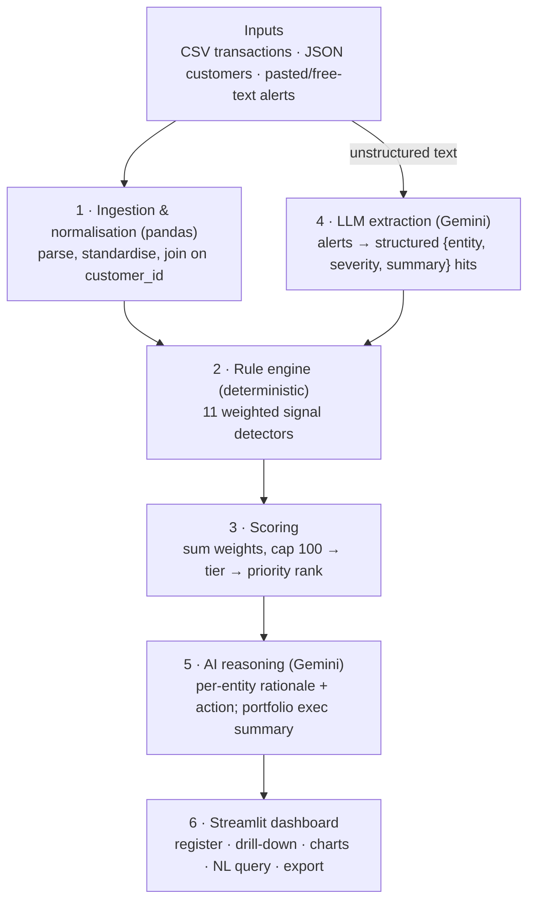
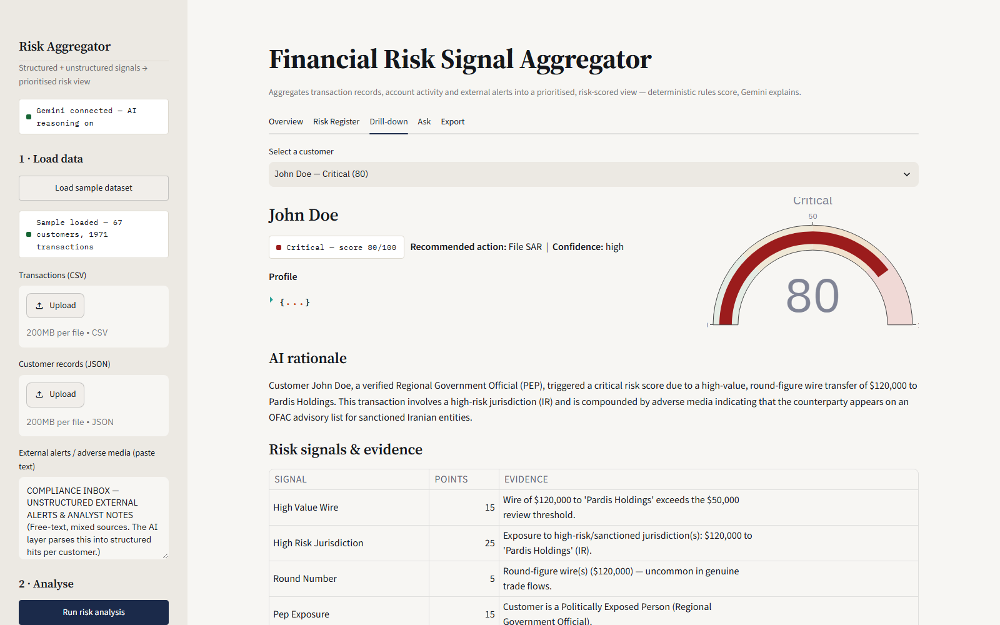

# Financial Risk Signal Aggregator — Project Summary

> Written companion to the [5-slide deck](docs/Financial_Risk_Signal_Aggregator_Deck.pptx),
> covering the four fixed sections in prose form. See [README.md](README.md) for setup
> instructions and [PROGRESS.md](PROGRESS.md) for build/status history.

---

## 1. Problem Understanding and Objective

Compliance and risk teams at financial services firms currently review transaction
alerts, customer/KYC records, and external data (news, watchlists, adverse media)
largely by hand. Three problems fall out of that:

- **Fragmented review.** The three information sources live in separate systems.
  Nothing correlates them automatically, so an analyst has to manually cross-reference
  a transaction pattern against a customer's KYC status against a news search — for
  every case, every day.
- **No signal correlation.** A single weak signal (an incomplete KYC field, one
  unusual wire) rarely looks urgent on its own. The real risk often only becomes
  visible when two or three *independent* weak signals from different sources line
  up on the same customer — and today, nothing surfaces that combination
  automatically.
- **Alert fatigue at volume.** With large transaction volumes, analysts can't
  manually triage everything with equal attention. There's no reliable way to know,
  right now, which handful of cases actually matter most.

**Objective:** build a 3-day AI proof-of-concept that ingests both structured data
(transaction records, customer records) and unstructured data (free-text alerts) and
produces one **prioritised, risk-scored, explainable** view — so an analyst sees *who*
to review first, *why* (with cited evidence), and *what to do next*, instead of a
bigger data dump.

**Definition of success used throughout the build:** the system must (a) correctly
flag genuinely risky customers with traceable evidence, (b) correctly leave clean
customers alone (precision, not just recall), and (c) explain every finding in
compliance-appropriate language grounded only in real evidence — never a black box.

---

## 2. Solution Architecture and Design Flow

**Core design principle: deterministic rules score the risk; the LLM only explains
it.** A transparent, hand-auditable rule engine computes the numeric 0–100 risk score.
Gemini is used for exactly two jobs — reading unstructured alert text, and writing the
human-readable rationale — and it is explicitly instructed never to invent or alter
the score. This is what makes the tool's output defensible to a compliance function
rather than a black-box AI guess.

### Data flow



### Why this shape

- **Explainable by construction.** Stages 1–3 run with **zero LLM calls**. A complete,
  reproducible risk register exists before any AI narrative is added — every score can
  be traced back to the exact rule and evidence that produced it, entirely in plain
  Python.
- **Multi-source correlation.** Weak signals from three different sources (a
  transaction pattern, a KYC gap, a news mention) aggregate per `customer_id` into one
  strong, prioritised case — this is the actual "aggregator" in the product name.
- **Cost- and latency-aware.** The LLM is only invoked for customers where at least one
  rule already fired (`if entity_risk.signals and is_available()` in `src/llm.py`).
  Clean customers get an instant templated response, no API call. On the current
  67-customer dataset this means ~13 Gemini calls total (not 67), which is what makes
  scaling the demo up practical on a free API tier.
- **Graceful degradation.** Every Gemini call has a deterministic fallback — a
  heuristic keyword extractor for alerts, a templated rationale for entity explanations.
  If the API key is missing or a call fails, the app still produces a complete,
  correct risk register; it just loses the AI-written narrative polish.
- **Compliance-defensible.** Because the score is rule-based and the rationale is
  evidence-grounded (prompts explicitly say "use only the supplied evidence"), an
  analyst — or an auditor — can always answer "why did this customer score 80?" with a
  concrete, traceable answer.

---

## 3. Implementation Highlights

**Rule engine — 11 explainable signals**, each a small pure function in
`src/rules.py`, with weights and thresholds centralised in `config.py` so the whole
scoring model is auditable in one file:

```python
# config.py — every weight is a named, auditable constant
WEIGHTS = {
    "STRUCTURING": 30, "HIGH_RISK_JURISDICTION": 25, "PASS_THROUGH": 25,
    "VELOCITY_SPIKE": 20, "DORMANT_REACTIVATION": 20, "ADVERSE_MEDIA": 20,
    "HIGH_VALUE_WIRE": 15, "PEP_EXPOSURE": 15, "KYC_INCOMPLETE": 10,
    "CASH_INTENSIVE": 10, "ROUND_NUMBER": 5,
}

def score_to_tier(score: int) -> str:
    # 0-24 Low · 25-49 Medium · 50-74 High · 75-100 Critical
    ...
```

Typologies covered: structuring/smurfing, sanctioned-jurisdiction exposure, PEP
status, dormant-account reactivation, same-day pass-through layering, velocity
spikes, cash-intensive activity, round-figure wires, incomplete KYC, and
LLM-extracted adverse media.

**Gemini does exactly two jobs**, never a third (scoring):
1. Parse free-text alerts into structured `{entity_id, alert_type, severity, summary}`
   hits, matched to customers by name.
2. Write a 3–4 sentence rationale + recommended action (Monitor → Enhanced Due
   Diligence → Escalate to MLRO → File SAR) for each flagged customer, plus a
   portfolio-level executive summary.

Every prompt is guardrailed to use only the supplied evidence; responses are parsed
as strict JSON and validated with pydantic (`src/schemas.py`), with one retry and a
templated fallback if parsing fails.

**A real screenshot from the running app** (not a mockup):



John Doe scores 80/100 (Critical). The score comes entirely from rule weights (High
Value Wire +15, High Risk Jurisdiction +25, Round Number +5, PEP Exposure +15,
Adverse Media +20); Gemini's job was only to explain *why* those signals matter in
one paragraph and recommend filing a SAR.

**Verified, not assumed:**
- 7/7 pytest scenario tests pass, asserting specific planted cases land in their
  expected tiers (`tests/test_scoring.py`).
- The full pipeline was run against the **live** Gemini API (not just the offline
  fallback), and every screenshot in this repo was captured from the actual running
  app via Playwright — including the production deployment on Railway.
- Model resilience: free-tier pinned Gemini model versions (`gemini-2.0-flash`, etc.)
  were retired by Google for new API keys mid-build; fixed by switching to the
  rolling `gemini-flash-latest` alias with an automatic secondary-model retry.

---

## 4. Challenges and Learnings

**Explainability vs. black-box AI.** A single end-to-end "ask the LLM for a risk
score" design would have been faster to build but indefensible to a regulator or
auditor. The trade-off was resolved by splitting scoring (deterministic, rule-based)
from narrative (AI-generated) — slower to design, but the resulting score is fully
traceable, which matters far more for a compliance audience than raw model
sophistication.

**Hallucination risk in the rationale.** An LLM asked to "explain risk" will happily
invent supporting detail if not constrained. Mitigated three ways: prompts explicitly
restrict the model to the supplied evidence only; every response is validated against
a strict pydantic schema with a retry-then-fallback path; and, structurally, the model
is never given write access to the score itself — it can restate it, never change it.

**Precision vs. sensitivity, tested at scale.** A tool that flags every customer is
useless to an analyst. Rather than relying on a single hand-picked "clean" example,
the sample dataset was deliberately scaled to 67 customers with 56 genuinely clean —
and the register correctly leaves all 56 at 0/Low. That's a meaningfully stronger
precision claim than one control case, and it's what pushed a UI fix: the original
"plot every customer" chart became unreadable at this scale, so the dashboard was
changed to default to flagged-only views with an explicit toggle to reveal everyone —
which is itself a better answer to "help analysts focus on what matters" than the
original design.

**Free-tier model churn.** Midway through the build, Google retired free-tier access
to the pinned Gemini model versions this project was built against — calls started
returning `404`/`429 quota=0` with no code change on our side. The fix (switch to the
rolling `-latest` alias, add an automatic fallback-model retry) was straightforward,
but the underlying lesson generalises: don't pin a third-party model version string in
a project meant to keep working; depend on the rolling alias and always have a
fallback path.

**Real bugs only surface under real use.** Two defects were found not by code review
but by actually driving the deployed app end-to-end with Playwright screenshots:
Streamlit renders bare `$` as LaTeX math, silently garbling every dollar amount in the
AI-generated text; and a "Load sample dataset" button that worked correctly but gave
no visible confirmation, making it look broken. Neither would have been caught by unit
tests alone — the takeaway was to always visually verify the actual running UI, not
just the underlying logic.
